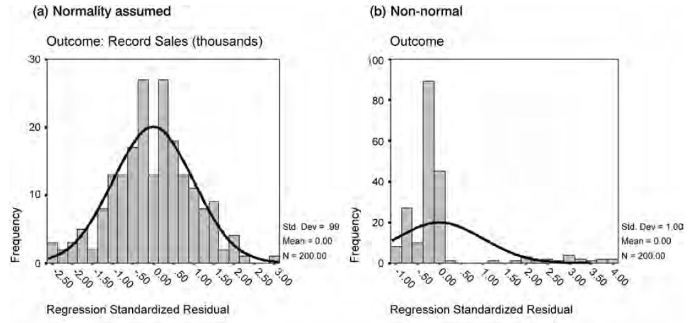
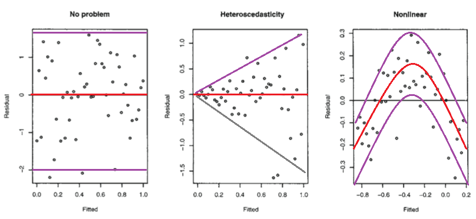

# Assumptions for Linear Regression

## Introduction
Least Squares is one of the most common regression techniques for linear models. As long as our model satisfies the least squares regression assumptions, we can get the best possible estimates. In this lesson, you will learn about these assumptions.

## Objectives
You will be able to:

- Understand and discuss the assumptions that must be held for least squares regression
- Understand linearity, normality and heteroscedasticity assumptions
- Identify approaches to check for regression assumptions

## About Regression Assumptions

Regression is a powerful analysis technique that is routinely used to answer complex analytical questions. However, if some of the necessary assumptions are not satisfied, you may not be able to get good and trustworthy results!

In this lesson, you'll dig deeper on the topic of ordinary least squares regression assumptions. Additionally, you'll learn about their importance as well as some techniques to help us determine whether your model satisfies the assumptions.

## Regression is "Parametric"

Regression is a parametric technique, which means that it uses parameters learned from the data. Because of that, certain assumptions are made. These assumptions define the complete scope of regression analysis and it is **mandatory** that underlying data fulfills these assumptions. If violated, regression makes biased and unreliable predictions. Luckily, we have measures to check for these assumptions. We provide an overview in this lesson!

## 1. Linearity

> The linearity assumptions requires that there is a **linear relationship** between the response variable (Y) and predictor (X). Linear means that the change in Y by 1-unit change in X, is constant. 

As shown above, If we try to fit a linear model to a non-linear data set, Ordinary Least Squares (OLS) will fail to capture the trend mathematically, resulting in an inaccurate relationship. This will also result in erroneous predictions on an unseen data set.  

>The linearity assumption can best be tested with scatter plots 

For non-linear relationships, you can use non-linear mathematical functions to fit the data e.g. polynomial and exponential functions. You'll come across these later. 

**Note: As an extra measure, it is also important to check for outliers as presence of outliers in the data can have a major impact on the model.**

In the above example, we can see that an outlier prohibits the model to estimate the true relationship between variables by introducing bias. 

## 2. Normality 

>Satisfying the normality assumption allows you to perform statistical hypothesis testing and to build reliable confidence intervals and prediction intervals.

The linearity assumption requires variables to be normally distributed for concluding some sort of statistical significance. It also requires that the calculated error values follow a normal distribution as well to produce unbiased estimates with the low variance.

However, keep in mind that this assumption is not mandatory for regression if you don't want to test any hypothesis (more on this later). OLS works fine for non-normal data distributions in the context of prediction. 

The easiest way to check for this assumption is with histograms or a Q-Q-Plots. 

### Histograms
We have already seen quite a few histograms and also know how to build them. You can use histograms to check the errors generated by the model and see if the plot shows a so-called "normal distcibution" (bell curve shape). As the error term follows a normal distribution, we can develop a better confidence on the results and thus calculate the statistical significance. An example of a regression error histogram is shown below:

### Q-Q Plots

>In statistics, a Q–Q (quantile-quantile) plot is a probability plot, which is a graphical method for comparing two probability distributions by plotting their quantiles against each other.

The Q-Q plot (quantile-quantile plot) is used to help assess if a dataset comes from a known distribution such as a normal distribution. For regression, when checking if the data is normally distributed, we can use a Normal Q-Q plot to test that assumption. Remember that this is just a visual check, so the interpretation remains subjective. However, it is a good first check to see the overall shape of data against required distribution. If you can reject normality through Q-Q plots, you have saved yourself from lot of statistical testing. You have to be careful, however, when deciding that data is totally normal just by looking at a Q-Q plot.

Below, you can find a few examples of comparing histograms and corresponding plots. You can see how the quantiles of normal data appear as a straight line along the diagonal when plotted against a standard normal distribution's quantiles. The skewness and kurtosis of data can also be inspected this way  

A Q-Q plot helps you validate the assumption of normal distribution. It uses standardized values of residuals to determine the normal distribution of errors. Ideally, this plot should show a straight line. A curved, distorted line suggests residuals have a non-normal distribution.[Here is a good article](https://data.library.virginia.edu/understanding-q-q-plots/) explaining the interpretation of Q-Q plots in detail. 

Normality can also be checked with goodness of fit tests such as the Kolmogorov-Smirnov test.  When the data is not normally distributed, there are some ways to fix that, such as a non-linear transformation (e.g., log-transformation).

## 3. Homoscedasticity 

> _Heteroscedasticity_ (also spelled heteroskedasticity) refers to the circumstance in which the dependent variable is unequal across the range of values of the predictor(s).

When there is heteroscedasticity in the data, a scatterplot of these variables will often create a cone-like shape. The scatter of the dependent variable widens or narrows as the value of the independent variable increases. 

The inverse of heteroscedasticity is _homoscedasticity_, which indicates that a dependent variable's variability is equal across values of the independent variable. **Homoscedasticity is the third assumption necessary when creating a linear regression model.**

A scatter plot is good way to check whether the data are homoscedastic (meaning the residuals are equal across the regression line).  The scatter plots shown here are examples of data that are heteroscedastic (except the plot far right). You can also use significance tests like Breusch-Pagan / Cook-Weisberg test or White general test to detect this phenomenon. You will learn about p-values later, but for now you can remember that, if these tests give you a p-value < 0.05, the null hypothesis can rejected, and you can assume the data is heteroscedastic.

## What Else?

There are other assumptions for linear regression that apply to more complicated cases, but for now these three assumptions are sufficient.

As a first check, always looks at plots for the residuals. If you see anything similar to what is shown below, you are violating one or more assumptions and the results will not be reliable.

## Summary 

In this lesson, you learned about some assumptions for simple linear regression that must be held in order to interpret the results reliably. As mentioned earlier, once these assumptions are confirmed, you can run your regression model. Next, you'll be exposed to some examples!
